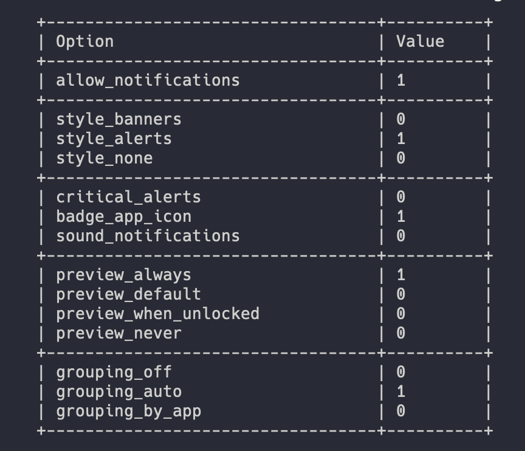

# NotificationCenterManager

  


Command-Line Interface for managing macOS Notification Center. It allows to:
- read all registered bundles in Notification Center;
- read bundle preferences;
- disable and enable notifications for a particular bundle identifier;
- manage concrete application settings:
    - notifications style;
    - notifications preview;
    - enable/disable sound, badge app icons, critical alerts.

## How it works

`ncmanager` deals with `com.apple.ncprefs.plist`, localed at directory `$HOME/Library/Preferences`. CLI writes new options to specified field, synchronise application preferences and relaunchs NotificationCenter application.

> Bundle preferences changes during a few seconds after the command is executed.

### Flags

Bundle raw in a plist file contains `flags` key with Integer value. Actually, it is a bitmask in a decimal format, representing selected notification preferences for app. 

| Option              | Bitmask |
| ------              | ----    | 
| badge_app_icon      | 1 << 1  |
| sound_notifications | 1 << 2  |
| style_banners       | 1 << 3  |
| style_alerts        | 1 << 4  |
| allow_notifications | 1 << 25 |
| critical_alerts     | 1 << 26 |

Every bundle has additional options for notification's preview and grouping. Keys and meanings are described below:

- `content_visibility` -  preview style for notifications;
- `grouping` - grouping style for notifications in Notification Center.

| Preview      | Grouping            | Value   | 
| ------       | ------              | ----    | 
| default      | automatic           |    0    |
| never        | byApplication       |    1    |
| whenUnlocked | off                 |    2    |
| always       | -                   |    3    |


## Use-cases 

`ncmanager` enables to forget about Mac Notification Center configuration.
1. Disable/enable notifications for applications. Especially useful for macOS Integration(UI) test to avoid notifications overlapping the target app.
2. Remotely manage macOS Notification Center.
2. Manage your Mac preferences from Terminal. You can rely on CLI and forget about changing settings from Preferences.app.
4. Disable annoying System Notifications from LaunchAgents, Tips and other build-in macOS application.

## Installation 

`ncmanagar` is available via Homebrew:

```bash
    $ brew install ncmanager 
```

Also you can build CLI locally. To do this, follow next commands:

```bash
    $ git clone NotificationCenterManager 
    $ cd NotificationCenterManager 
    $ swift build -c release --arch arm64 --arch x86_64
```

> Xcode 14.0 and higher is required to build package products.

## Usage 

`ncmanager` is case-sensitive - make sure you use correct bundle identifier.

### Change bundle preferences

```bash
    $ ncmanager write <bundle-id> [--icon <icon>] [--sound <sound>] [--notifications <notifications>] [--critical-alert <critical-alert>] [--alert-style <alert-style>] [--preview <preview>] [--grouping <grouping>]
```

### Read all registed identifier

```bash
    $ ncmanager read identifiers
```

### Read bundle preferences with command and get tiny output

```bash
    $ ncmanager read bundle com.apple.Mail
```

### Output format



## References and Credits

- [Kolide](https://www.kolide.com/blog/are-your-employees-slack-messages-leaking-while-their-screen-is-locked) - an powerful article with Notification Center bitfields description. 
- [NCUtil](https://github.com/jacobsalmela/NCutil/  ) - python script for Notification Center Management


